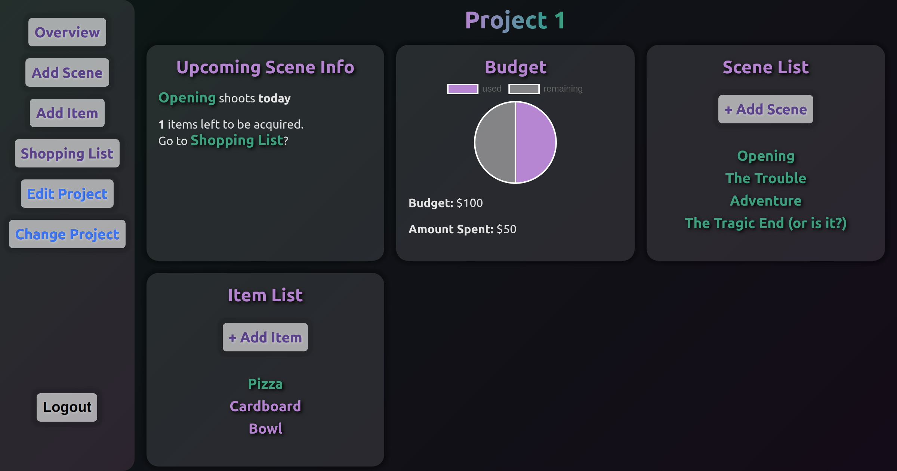

# Production Assistant Application

**[Live Site](https://production-assistant.vercel.app/)**  
**[Server](https://production-assistant-server.herokuapp.com)** 
**[Server Repo](https://github.com/marcuses101/Production-Assistant-Server)**

## Summary

 

Used with the Production Assistant API, this React Application helps film producers keep their projects organized. Manage scenes, items, acquisitions. Keep track of the project's budget, status of the upcoming scene, and items left to acquire. 
